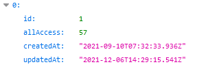
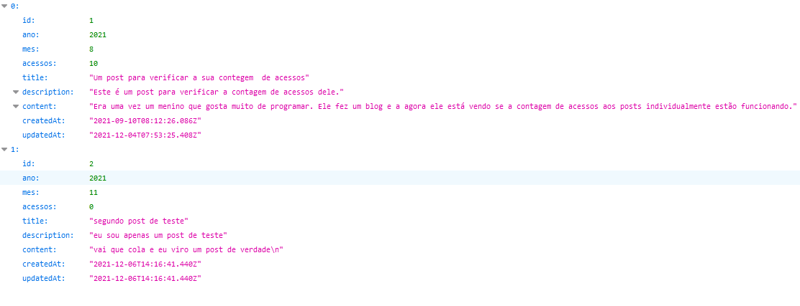

# Blog App Api

Blog App Api se trata da api rest que permite a criação, edição, remoção e busca no banco de dados, dos posts de uma apliação de blog de nome semelhante (blog app) que também pode ser encontrada neste github.

    
## SUMÁRIO

- Status
- Url
- Features e EndPoints
- Como Rodar a Aplicação
- Pré Requisitos Para Rodar a Aplicação
- Tecnologias utilizadas
- Autor

## Status

✨Concluído ✨

## Url

- [https://bloogappserver.herokuapp.com/](https://bloogappserver.herokuapp.com/)

## Features e EndPoints

### Rotas get

| EndPoint | Funcionalidade |
| - | - |
| /site-access | Retorna todos os acessos ao site. |

| EndPoint | Funcionalidade |
| - | - |
| /posts | Retorna um array com todos os posts, onde cada post é um objeto. |

### Rotas post

| EndPoint | Funcionalidade |
| - | - |
| /new-access | Cadastra os acessos divididos pelos anos e cada ano divido pelos meses. |
| /new-geral-access | Cadastra cada acesso ao site, representa todos os acessos que o site já teve. |
| /add | Cadastra os dados dos posts. |
| /new-post-access/:id | Atualiza o número de acessos a um determinado post. |

### Rotas put

| EndPoint | Funcionalidade |
| - | - |
| /edit/:id | Edita um post em especifico. |

### Rotas delete

| EndPoint | Funcionalidade |
| - | - |
| /delete/:id | Remove um determinado post. |

## Como Rodar a Aplicação

Para rodar a aplicação basta entrar na pasta do projeto pelo seu cli (promt de comando no windows por exemplo) e rodar dois comandos, o comando `npm i` para intalar as dependências do projeto e `node src/server.js` para iniciar o servidor. Desta a forma a aplicação estará em funcionamento na `porta 3001` no localhost.

## Pré Requisitos Para Rodar a Aplicação

Para rodar a aplicação você irá precisar ter o [node](https://nodejs.org/en/) instalado na sua máquina.

## Tecnologias utilizadas

- [Node](https://nodejs.org/pt-br/docs/)
- [Express](https://expressjs.com/pt-br/)
- [Cors](https://www.npmjs.com/package/cors)
- [Sequelize](https://sequelize.org/)
- [Sqlite](https://www.sqlite.org/docs.html)

## Autor

Feito por Vitor Mateus

 